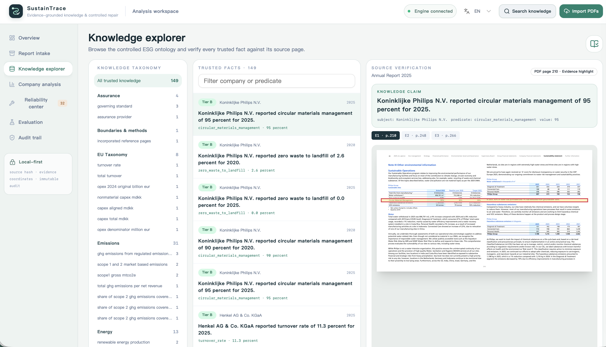
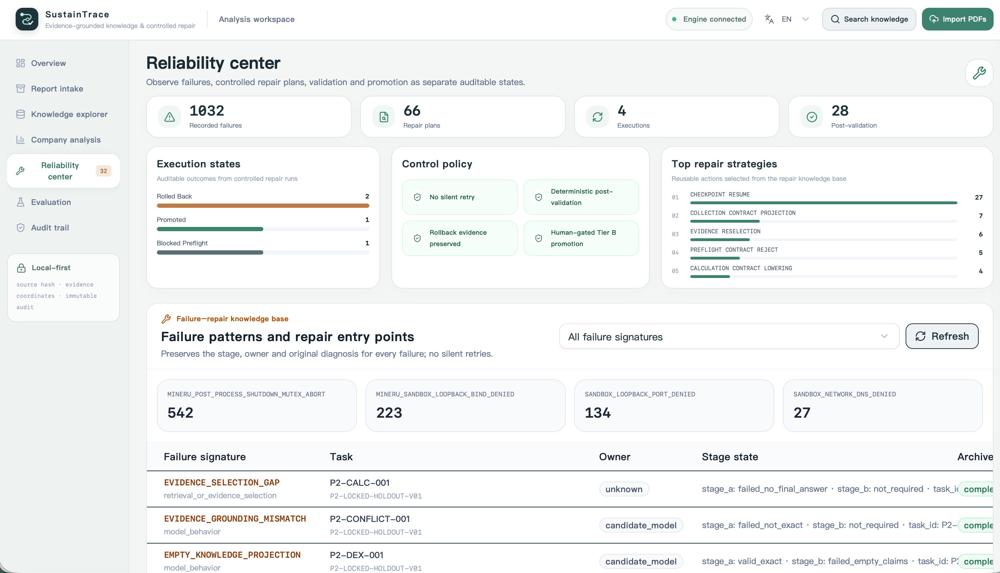
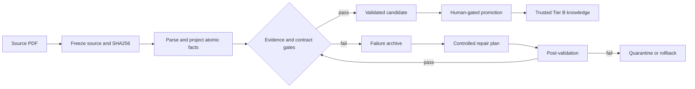

# SustainTrace

**Evidence-Grounded ESG Knowledge Discovery and Controlled Repair**

SustainTrace is an evidence-driven, auditable knowledge infrastructure for ESG reports, designed
for controlled evolution. It transforms fragmented and structurally complex corporate disclosures
into standardized, verifiable, and traceable structured knowledge, while preserving processing
failures, repair strategies, and validation outcomes as reusable methodological knowledge. The
result supports company analysis, cross-report comparison, longitudinal research, and knowledge
accumulation and reuse at scale.

Upload a collection of ESG reports, freeze every source before processing, build an evidence-linked
knowledge base, inspect accepted facts against their original pages, and analyze comparable
disclosures across companies and reporting periods.

## Product interface

[](docs/assets/sustaintrace-knowledge-explorer.png)

*Knowledge Explorer — browse controlled ESG facts and verify each claim against highlighted source
evidence.*

[](docs/assets/sustaintrace-reliability-center.png)

*Reliability Center — inspect failure signatures, controlled repair strategies, execution outcomes,
and immutable audit records.*

## Quick start

The source installation flow is the same on macOS, Windows, and Linux:

```bash
git clone https://github.com/extradimen/sustaintrace.git
cd sustaintrace
python bootstrap.py
python run.py
```

`bootstrap.py` creates isolated Python environments, installs SustainTrace and Poppler, installs
the pinned MinerU runtime, downloads and verifies 40 model assets, parses a generated smoke-test
PDF, and initializes the release knowledge seed. Model assets require approximately 2.6 GB in
addition to the runtime dependencies.

`run.py` serves the web interface and API on `http://127.0.0.1:8765` and opens the browser. End
users do not need Node.js or a manual `npm ci` step because the production frontend is embedded in
the Python package.

Run a read-only installation audit at any time:

```bash
python bootstrap.py --check
```

## Typical workflow

```text
PDF reports
  → source freezing and SHA256 registration
  → MinerU parsing or native PDF fallback
  → atomic fact projection
  → deterministic evidence and contract validation
  → trusted knowledge or a structured failure record
  → company, cross-report, and longitudinal analysis
```

## Why SustainTrace

General-purpose language models and document-analysis tools can read reports and generate answers,
but their outputs often remain difficult to verify, compare, and reuse. SustainTrace adds three
controls that are essential for reliable ESG knowledge construction:

1. **Evidence-level traceability** — every accepted fact remains linked to its source PDF, page,
   quotation, and, where available, table, row, column, cell, and layout coordinates.
2. **Controlled refusal** — missing disclosure, retrieval failure, structural parsing failure, and
   semantic conflict remain distinct states. Unsupported values are not silently completed or
   promoted as trusted knowledge.
3. **Auditable repair and promotion** — failures become structured diagnoses and repair plans.
   Repaired outputs must pass deterministic post-validation before human-gated promotion to the
   trusted knowledge layer.

## Two complementary knowledge layers

SustainTrace accumulates both domain facts and reusable processing experience.

### Report fact knowledge

Corporate disclosures are projected into atomic records with a common structure:

> entity — metric — value — period — unit — scope — boundary — assurance status — evidence

These records support source-level inspection, individual-company analysis, comparable
cross-company queries, and multi-year trend analysis without silently imputing missing values.

### Failure-repair method knowledge

The system also records which document structures fail, why they fail, which repair strategy was
selected, and whether post-validation succeeded. This method layer provides explicit evidence for
controlled system evolution rather than allowing opaque retries or retrospective answer editing.

## What SustainTrace validates

SustainTrace evaluates whether:

- extracted claims remain faithful to the report text;
- numeric values are bound to the correct table row, column, year, and unit;
- pages, quotations, and available table or layout coordinates are present and traceable;
- derived values can be deterministically recomputed from disclosed inputs;
- statistical boundaries, scopes, methods, exclusions, and assurance status are preserved;
- outputs satisfy the predefined atomic-fact and slot contracts; and
- insufficient evidence causes a controlled refusal instead of a fabricated trusted fact.

The framework can also identify controlled internal conflicts, such as different values reported
for the same metric, period, and statistical boundary within one document. It verifies evidence
fidelity and contract compliance; it does **not** independently establish that an issuer's
real-world disclosure is true.

## Controlled fact ontology

SustainTrace extracts facts that can be assigned to predefined semantic slots rather than storing
arbitrary sentences.

| Fact class | Examples |
|---|---|
| Quantitative metrics | Emissions, energy, water, waste, workforce, and incident rates |
| Targets and progress | Baseline year, target year, target value, current value, and completion rate |
| Taxonomy disclosures | Eligible and aligned turnover, CapEx, and OpEx values or proportions |
| Reporting boundaries | Included businesses, regions, entities, activities, and emission scopes |
| Methods and accounting | Calculation method, unit, market/location method, and restatement status |
| Exclusions | Excluded operations, Scope 3 categories, and target-boundary exclusions |
| Assurance facts | Provider, limited or reasonable assurance, and the metrics covered |
| Deterministic derivations | Year-on-year change, proportions, totals, and disclosed-versus-recomputed differences |
| Conflict and absence states | Not disclosed, not retrieved, structurally unrecoverable, or inconsistent boundary |

Every record is managed along two independent dimensions:

- **Semantic identity:** predicate, period, unit, scope, boundary, method, and assurance status.
- **Trust state:** candidate, validated, trusted Tier B, quarantined, or archived failure.

## Trust and repair lifecycle



Previously locked evaluations remain immutable. Model behavior failures are archived without
silent retries; infrastructure interruptions may resume only from explicit checkpoints with their
interruption evidence preserved.

## Release knowledge boundary

The default release seed contains:

- 149 independently reviewed Tier B trusted facts;
- 34 controlled issuer entities;
- 149 explicit relation edges; and
- 1,032 failure observations for controlled repair research.

Candidate facts and simulated references remain outside the default trusted layer. Original issuer
PDFs are not bundled. The application initializes the release seed without overwriting an existing
workspace.

## Limitations

- SustainTrace verifies evidence fidelity and contract compliance; it does not establish that an
  issuer's real-world disclosure is true.
- Complex tables may still require controlled fallback parsing or human review.
- Trusted Tier B promotion remains human-gated.
- Controlled evolution means that failures, repair strategies, and validation outcomes are stored
  as reusable method knowledge. It does not mean unconstrained autonomous code modification.
- Windows and Linux installation paths are implemented but require independent GitHub Actions
  runner evidence before they can be described as fully platform-verified.

## SoftwareX metadata

| Item | Value |
|---|---|
| Current version | 0.1.0 |
| Source repository | <https://github.com/extradimen/sustaintrace> |
| Reproducible archive | Zenodo DOI pending the first immutable public release |
| License | Apache License 2.0 |
| Version control | Git |
| Languages and tools | Python, TypeScript, React, MinerU, Poppler, and Ollama adapters |
| Supported platforms | macOS verified locally; Windows and Linux installation paths implemented and covered by CI |
| Installation | `python bootstrap.py` |
| Launch | `python run.py` |
| Developer documentation | [`docs/SOFTWAREX_REPRODUCIBILITY.md`](docs/SOFTWAREX_REPRODUCIBILITY.md) |

## Development and validation

```bash
uv sync --extra dev
uv run pytest
uv run ruff check .
cd workbench-ui
npm ci
npm run lint
npm run build
npm run build:static
```

MinerU is an enhanced parsing channel, not the evidence authority. Every factual conclusion must
resolve to the original PDF hash and page. Runtime versions are locked in
`configs/parsers/mineru-runtime.lock.json`; model assets are locked in
`model_manifests/mineru-pdf-extract-kit-1.0-ed6b654c.lock.json`.

The legacy hot-reload supervisor remains available for frontend development:

```bash
python scripts/run_workbench.py --status
python scripts/run_workbench.py --stop
```

## Documentation

- [Source Distribution Policy](docs/SOURCE_DISTRIBUTION_POLICY.md)
- [SoftwareX Reproducibility and Release Checklist](docs/SOFTWAREX_REPRODUCIBILITY.md)
- [Release Engineering Milestone](docs/RELEASE_ENGINEERING_MILESTONE.md)
- [Contributing](CONTRIBUTING.md)
- [Security Policy](SECURITY.md)
- [Changelog](CHANGELOG.md)

Numbered documents in `docs/` are internal experiment logs retained for auditability. They may be
written in English or Chinese and are not part of the public milestone-document set. All
publication-facing documentation is maintained in English and checked automatically by the release
validator.

## Source-report policy

SustainTrace publishes code, schemas, derived facts, evidence coordinates, and failure-repair
records under the project license. Corporate source PDFs are governed by their original copyright
and are not included in the distribution. See the
[Source Distribution Policy](docs/SOURCE_DISTRIBUTION_POLICY.md) for the complete classification.

## Citation and license

Citation metadata is available in [`CITATION.cff`](CITATION.cff). SustainTrace is distributed under
the Apache License 2.0. A permanent DOI will be added after the first immutable public release is
archived.
