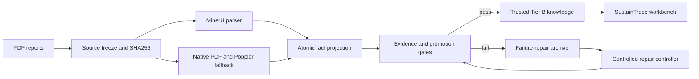

# SoftwareX Reproducibility and Release Checklist

## Minimal reproduction

```bash
git clone https://github.com/extradimen/sustaintrace.git
cd sustaintrace
python bootstrap.py
python run.py
```

`bootstrap.py` creates isolated application and MinerU environments, installs Poppler, downloads
the model assets from the locked revision, verifies every asset by SHA256, runs a one-page PDF smoke
test, and initializes the trusted-fact and failure-repair knowledge bases.

## Software architecture



## Article and archive materials

- Release seed: 149 Tier B facts, 34 controlled entities, 149 relation edges, and 1,032 failure
  observations.
- Evaluation evidence: lockbox results and the 120-report expansion acceptance records under
  `data/results/`.
- Suggested software figures: Overview, Knowledge Explorer, Reliability Center, Evaluation, and
  Audit Trail views.
- Reproducible configuration: `configs/`, `schemas/`, `model_manifests/`, and `uv.lock`.
- Continuous integration: `.github/workflows/cross-platform.yml`.
- Permanent DOI: to be created through Zenodo after the first public GitHub Release. No DOI should
  be asserted before that archive exists.

## Pre-release blocking items

- The complete three-platform MinerU workflow must pass on GitHub Actions.
- A public release tag, source archive, and Zenodo DOI must be created on the remote repository.
- Article statistics and figures must be regenerated from valid lockbox results under one declared
  statistical protocol. The invalid P9 aggregate score must not be included.
